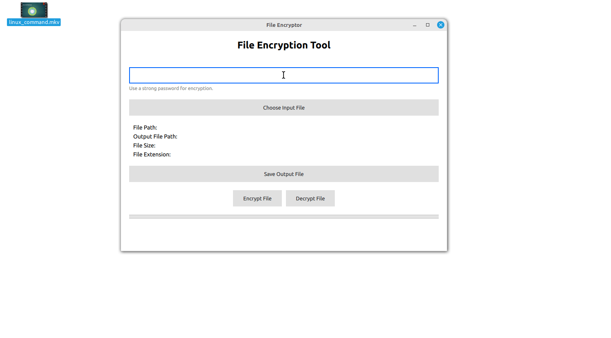

# File Encryption and Decryption Application

This application is a simple GUI tool that allows users to encrypt and decrypt files using a secure password-based mechanism. Built with the Qt framework, it offers an intuitive interface for selecting files, viewing file details, and performing encryption and decryption operations.



## Project Overview

The main features of the application include:

- **File Selection:** Users can select files to encrypt or decrypt using a file dialog.
- **Encryption/Decryption:** The application can encrypt files, appending a `.enc` extension, and decrypt files with this extension back to their original format.
- **File Details Display:** Upon selecting a file, the application displays its path, size, and extension.
- **Customizable Password:** Users can set a password for encryption, ensuring that files remain secure.

## Prerequisites

Before you begin, make sure you have the following installed:

- **Qt 5.15+** or **Qt 6.0+** (with Qt Creator)
- A C++ compiler (e.g., `g++`, `clang++`)
- CMake (optional, if using CMake for build configuration)

## Getting Started


### 1. Build the Project

#### Using Qt Creator

1. **Open Qt Creator**: Launch the Qt Creator application.
2. **Open the Project**: Navigate to `File` -> `Open File or Project...` and select `CMakeLists.txt` or the `.pro` file in the cloned directory.
3. **Configure the Project**: Choose the appropriate kit for your environment.
4. **Build the Project**: Click on the build button or use `Ctrl + R` to run the project directly.

#### Using Command Line

If you prefer building from the command line, you can use the following commands:

```bash
mkdir build
cd build
cmake ..
make
```

This will compile the project and generate an executable in the `build` directory.

### 2. Running the Application

Once the build process is complete, you can run the application by executing the generated executable file:

```bash
./file-encryptor   # Or the name of your generated executable
```

## Usage Instructions

1. **Select a File:** Click on the "Select File" button to choose the file you want to encrypt or decrypt.
2. **Encrypt a File:**
   - After selecting a file, click on the "Encrypt" button.
   - The application will create an encrypted version of the file then you can save it by using Save File Button  (with `.enc` or any other extension)
3. **Decrypt a File:**
   - Select an already encrypted file (with `.enc` or any other extension).
   - Click on the "Decrypt" button to restore the original file , then you can save it by using Save File Button
4. **Set Password:** You can set or change the encryption password before performing encryption or decryption operations.
